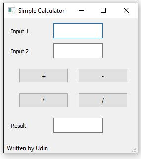

#Simple Calculator GUI

This scripts was written under **Python 3.5** and using **Pycharm Community Edition**.

Make sure you have **PyQt5** installed already or for easy way just install **Anaconda**.

# How to run

Using command line:

​		`python SimpleCalc_GUI.py`

or run it by using PyCharm IDE.

# Screenshot

#### Note:

You can freely use or reuse this script.

Hope it might be useful.

Thank you.

[justudin]: www.justudin.com